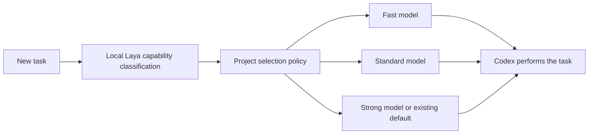

# laya-tools

The current qualified finite development data contains **37 requests and108 labels**, published as the [immutable HF37 release](https://huggingface.co/datasets/JooYoon/riidolaya-shortclaim-next60-development/tree/next60-37-finite-v1). The [nonlearned ordering diagnostic](experiments/short-claim/next60-development37-bias-audit/README.en.md) favored lexical ordering at29/37 first choices, but position bias and platform-specific ties prevent interpreting this as learned-model benefit or actual Codex savings.

An [unknown/ambiguity-preserving Go input API](pkg/shortclaimdata/COHORT.en.md) now prepares for the next five/eight-candidate cohort. U never becomes false, and ambiguity retains known T/F facts. Every row, including audit-only rows, is checked for declared role leakage before complete known parents with eligible rows enter the existing projection.

The [actual audit of the next xxhash parent](experiments/short-claim/next-cohort-xxhash-audit/README.en.md) compared15 inputs × five candidates. Direct checks and full-state reconstruction matched15/15; digest comparison matched7/15. These75 trials are not75 independent examples, and unresolved lineage keeps this parent out of training. New cohort labels, training and protected2,400 evaluation remain pending.

## Earlier checkpoints

The figures and publication statuses below are historical snapshots. Use the links above for the latest data and next input path.

[Development data for the small claim/hint model](experiments/short-claim/next60-development-thirtyfive/README.en.md) now has **35 requests and 102 labels**. The actual Go Reader completed35 calls, returns and full value matches; the previous33 rows remain byte-exact. The [offline check](scripts/verify-next60-thirtyfive.sh) matched309 predicates from two added requests and the complete35-row data locally and is added to CI. New Fits remain0. About60 requests still requires source deduplication, family-role separation and candidate-position review before training. Codex savings remain unproven.

[PR125 CI, actual Linux differences and storage records](experiments/short-claim/publication-proof-126/README.en.md) are preserved. All four required CI jobs passed and the bot merged it; complete Linux results retain small score differences and actual tie/order changes. The35-row positive-position distribution remains biased at5,28,2. Two completed HF33 temporary copies,334 files, were restore-verified and archived, conservatively reclaiming about1.24MB of logical storage. This measures neither model memory nor cost savings.

The [immutable HF33 release](https://huggingface.co/datasets/JooYoon/riidolaya-shortclaim-next60-development/tree/next60-33-finite-v1) is published. All82 changed files were downloaded and hash-verified; the complete638-owned-file inventory and every value/order in33 viewer rows were verified. See [publication, Go controls and next-fit preparation](experiments/short-claim/publication-proof-125/README.en.md). PR124's Linux/macOS33-row reproduction and existing native Laya steps passed separately, and the CI bot merged it. GPU execution was not verified.

On33 requests, lexical ordering achieved26 correct first choices and43 simulated checks, but28 positives occupied the second position. A post-hoc second-position-first rule achieved28 correct choices and39 simulated checks. Position bias and trivially successful Top3 with only2–3 candidates must be addressed before evaluating a learned model. [Go input controls and full nonlearned comparison reproduction](scripts/verify-next60-learning-preparation.sh) are added to CI; independent2,400-request evaluation data remains a plan.

[Expectations and captions for three tasks](experiments/short-claim/next60-native-three-preparation/README.en.md) were frozen before observing 42 actual dispatches across 14 inputs and nine candidates. Three positive and five negative candidates were adopted; one candidate with an unavailable original JSON Int error channel remains unlabelled and excluded. Known counterexamples and unavailable predicates remain separately recorded even when both occur. [Prior PR122 CI, Wiki delivery and storage records](experiments/short-claim/publication-proof-123/README.en.md) are preserved.

<details>
<summary>Earlier stage history — counts and “current” below refer to their recorded stages</summary>

The [immutable HF30 release](https://huggingface.co/datasets/JooYoon/riidolaya-shortclaim-next60-development/tree/next60-30-finite-v1) passed558-owned-file and30-viewer-row value/order verification. [PR121 CI/publication evidence](experiments/short-claim/publication-proof-122/README.en.md) and [22 proposed contracts and holds](experiments/short-claim/next60-new-source-preview/README.en.md) are preserved.

[Next development round](docs/wiki/Next60-Development-EN.md): the [current finite development subset](experiments/short-claim/next60-development-seven/README.en.md) has **seven requests and 20 labels**. [Actual execution and independent review of four requests](experiments/short-claim/next60-four-selector-actual-observation/README.en.md) covered 19 inputs and 57 observations. The original-code validation process peaked at about 7.89 MiB OS RSS; this is not model inference memory or demonstrated cost savings. The previous three rows remain byte-for-byte unchanged. The [immutable seven-request HF release](https://huggingface.co/datasets/JooYoon/riidolaya-shortclaim-next60-development/tree/next60-7-finite-v1) passed verification of 112 files and seven viewer rows; see the [publication record](experiments/short-claim/publication-proof-116/HF-PUBLICATION.v3.json). No new fit has run. Work continues on [literal preparation of ten further semantic requests](experiments/short-claim/next60-catalog10-literal-correction/TRANSITION.en.md).

[Two finite development requests are qualified](experiments/short-claim/next60-native2-qualification/README.en.md) for the next training round. Five candidates from two existing draft IDs have two positive and three negative labels; every text passed the existing input limits. The old 79-request corpus is unchanged and no new fit has run. Qualified data will expand toward 30/60 before a separate fit comparison.

The [first two requests have actual original observations](experiments/short-claim/next60-native2-actual-observations/README.en.md). One child executed five candidates across nine inputs for two requests: 23 observations, no panics or unknowns. Suitable candidates satisfied 5/5 and 4/4 inputs; other candidates mismatched in 14 observations. Child OS maximum RSS was about 9.11MiB and startup/pin-inclusive wall time about 0.37s. These are original-code observations, not model inference or demonstrated savings. Qualification and new fitting were zero at that observation; held records and the [v5 source fix](experiments/short-claim/next60-native2-outside-v5-preparation/README.en.md) are preserved.

The next PDCA qualifies [20 concrete contract drafts](experiments/short-claim/next60-acquisition-drafts/README.en.md) toward checkpoints of 30 and 60. The new round now has seven qualified requests; repeated tuning on the same 79-request collection has stopped. Read the [evidence, domain boundaries and protected 2,400-request plan](experiments/short-claim/next-pdca-after-79/REPORT.en.md). Failed79 is archived inactive at an [immutable HF commit](https://huggingface.co/JooYoon/riidolaya-shortclaim-data-effect-failed-79/tree/5bef215895b69d3f2ef4b82bb3f1970279d67f46), with all 21 files downloaded again and hash-verified.

Recent [data-addition fit79](experiments/short-claim/data-effect-fit-79/README.en.md) added three verified requests and actually trained under the same recipe. It required31 candidate checks, identical to the previous model and above the lexical control's27, failing the improvement gate. The whole CPU-one fit worker took1.244s with35.08MiB OS peak RSS; the new model remains inactive.

The [two earlier small learned models](experiments/short-claim/second-ranking-fit-72/README.en.md) also failed utility gates. [Go feature computation](experiments/short-claim/feature-prefix-74/README.en.md) was approximately20–24% faster on two public fixtures, with unchanged allocations.

[Public function verification](experiments/short-claim/native-observation-80/ACTUAL-RESULTS.en.md) matched predeclared expectations on24 UUID Parse, Scan and Ordinal inputs. Whole-program RSS17.27 MiB/wall1.21s describe neither model inference nor24 independent requests. [Research and failure history](RESEARCH-HISTORY.en.md) and [detailed documentation](docs/README.md) retain the scope and evidence.


</details>

[한국어](README.md) · **English** · [User Wiki](https://github.com/teamswyg/laya-tools/wiki) · [Documentation](docs/README.md)

[](https://github.com/teamswyg/laya-tools/actions/workflows/ci.yml)
[](https://github.com/teamswyg/laya-tools/releases/latest)
[](go.mod)
[](LICENSE)
[](docs/repository-routing-preview.en.md)

**A local experiment in letting projects own their AI model selection policies.**

The executable is **`riidolaya`**. The repository and Go module remain `laya-tools`, distinct from the upstream Laya model and SDK.

[Start here](https://github.com/teamswyg/laya-tools/wiki/Getting-Started-EN) for installation and a first result without downloading a model. Choose code search, model planning, or repository preview according to the job you want to do.

We run the small [Laya](https://huggingface.co/convaiinnovations/laya) decision model locally to classify task requirements. Codex performs the actual coding. In code search, Laya can reorder candidate excerpts before a larger model reads them.

Search, routing, tokenization, inference calls, and agent interfaces are implemented in Go. Users need neither Python nor a separate model API key. **Codex integration is optional.** Interfaces are being developed for eventual use in riido-daemon.

> This is an early experiment. Local execution and CI work, but reductions in actual Codex cost or subscription usage have not been demonstrated.

## Why this project exists

The project began after a notice about changes to Codex plans and included usage. Models differ in capability, usage, latency, and reasoning settings, while predicting what a task needs still relies heavily on human judgment.

A typo in a comment and a concurrency failure across services may not need the same model. We use development capacity to explore that distinction and investigate whether a local model can handle repeated small decisions.

Our hypothesis is that **assigning models to AI agents is a separate project-management responsibility involving quality, budget, and schedule. The project should own that policy.**

Providers' commercial incentives and users' cost goals may not always align. Users should be able to observe and adjust selection criteria rather than assume a provider always assigns the most economical model. This is not a claim that any company deliberately wastes tokens or will stop optimizing. Provider improvements do not establish whether a particular project's success criteria and budget are met. The design does not depend on a specific, changing price table.

The goal is lower total cost of successful completion, not maximum use of small models. A cheaper model that repeatedly fails can cost more. Evaluate success, elapsed time, usage, and rework together.

## What Laya and Codex do

Laya is a decision classifier, not a code generator. It reads input and chooses among supplied options. Jevgrep inspired parts of this approach, but our local inference uses public Laya weights; Jev and Laya are not the same model.



Typos, ordinary bounded features, and difficult debugging are examples of fast, standard, and strong categories. These are classification criteria, not accuracy guarantees. Low confidence, truncated input, or unsupported conditions retain the strong/default model. An explicit model override wins.

Routing happens once when starting a **new Codex CLI session**. It neither switches a live conversation nor intercepts API requests.

## Shout-out: Laya and laya.tools

Thanks to the developers of [Laya](https://huggingface.co/convaiinnovations/laya), its [open-source SDK](https://github.com/NandhaKishorM/laya), and **[laya.tools](https://laya.tools/)**, an independent community directory of runtimes, routing, agent tools, search, and demos.

- [Directory](https://laya.tools/): projects organized by use case and platform.
- [Local execution guide](https://laya.tools/guides/run-laya-locally).
- [Showcase](https://laya.tools/showcase).
- Apple Silicon runtimes such as laya-mlx and laya-coreml are candidates for future comparison.

We are not an official product or affiliate of laya.tools or the Laya team. Other projects' performance claims are not measurements of this tool.

## Available features

| Command | Purpose |
|---|---|
| `search` | Find code by keywords and optionally rerank with Laya. |
| `route` | Recommend a model without running Codex. |
| `plan` | Compare a configured model catalog, budgets, and switching costs without execution. |
| `repo-preview` / `repo-serve` | Preview repository candidates from local metadata; one request or warm JSONL. |
| `codex` | Start a new task in the installed Codex CLI. |
| `serve` | Keep the model loaded for sequential search/route JSONL requests. |
| `mcp` | Expose code search and model recommendations to agents. |
| `bench` | Measure model startup and inference; optionally collect Go profiles. |
| `setup` / `doctor` | Install verified assets and inspect the local environment. |

Subscription-quota lookup, live price discovery, automatic policy changes based on remaining usage, and retrying failed work on a stronger model are not implemented. Current automatic model selection uses task classification and explicit policy.

## Installation and first run

Apple Silicon macOS is the primary target; Linux amd64 also runs in CI. Download the matching `riidolaya-v…-darwin-arm64.tar.gz` or `riidolaya-v…-linux-amd64.tar.gz` from [Releases](https://github.com/teamswyg/laya-tools/releases). Compare its SHA-256 against `SHA256SUMS` before extraction. Keep the bundled LICENSE, NOTICE, and licenses directory if redistributing it.

Building from source requires Go 1.27.1 and a C compiler. On macOS, Command Line Tools supply the compiler.

```sh
git clone https://github.com/teamswyg/laya-tools.git
cd laya-tools
go build -trimpath -o bin/riidolaya ./cmd/riidolaya

# A first result without downloading a model
./bin/riidolaya search --root . --lexical --json 'routing confidence'

# Optional: install the local model and native runtime
./bin/riidolaya setup
./bin/riidolaya doctor
./bin/riidolaya search --root . 'where is routing confidence checked?'
```

v0.1.0 used the command `laya`; current versions use `riidolaya`. Existing `LAYA_*` environment variables and the cache location remain supported. `setup` updates older model bundles to the current, checksum-pinned bundle.

Examples below assume `riidolaya` is on PATH. After a source build, use `./bin/riidolaya` instead. **Put flags before the query.**

`setup` downloads the public model and ONNX Runtime and verifies archive and file SHA-256 values. The current model archive is about 446 MiB; its model file is about 572 MiB. Subsequent inference is local. Caches are `~/Library/Caches/laya-tools` on macOS and `~/.cache/laya-tools` on Linux; override with `LAYA_CACHE`. The executable uses separate cached model and native-library files.

Local Laya decisions incur no external model API fee, but consume CPU, RAM, and power. Downstream Codex usage follows your existing plan or billing arrangement.

## Code search

```sh
riidolaya search --root /path/to/repository 'where are redirect headers removed?'
riidolaya search --root . --lexical --json 'redirect authorization'
riidolaya setup --checkpoint code
riidolaya search --checkpoint code --candidates 8 --limit 3 'redirect authentication'
riidolaya search --candidate-query 'gzip decoder' 'gzip 압축을 해제하는 코드'
```

The pipeline is keyword candidates → optional Laya relevance → overlapping excerpt removal → paths, line numbers, and excerpts. Defaults are eight candidates and up to three results. No vector database is created.

At a Git root, search uses Git file lists and ignore rules. Subdirectories and ordinary directories require `rg`. Files are read again on each request. `serve` and `mcp` keep the model loaded, not a permanent code index.

Bounds include 32 MiB of source, 50,000 chunks, 256 KiB per file, 64 candidates, and 512 model tokens per candidate. Hidden files, vendor directories, symlinks, obvious credential filenames, and binaries are excluded. These rules are not a comprehensive secret scanner. Truncation is reported.

Laya cannot recover a relevant file absent from the keyword shortlist. Korean retrieval quality is unvalidated. If the model or runtime is unavailable, search returns keyword results with a warning.

## Model routing

Configure actual model IDs available to you. Model names and prices are not hardcoded.

```sh
export LAYA_FAST_MODEL='your-fast-model-id'
export LAYA_STANDARD_MODEL='your-standard-model-id'
export LAYA_STRONG_MODEL='your-strong-model-id'

riidolaya route --json 'Fix a spelling mistake in this comment'
riidolaya codex --dry-run 'Investigate a concurrency bug'
riidolaya codex 'Investigate a concurrency bug'
riidolaya codex --model 'your-explicit-model-id' 'Implement the feature'
```

`route` only recommends. `codex` frees Laya memory and starts your installed Codex with its existing authentication, permissions, and approval settings. The Codex task communicates with its normal provider; the router does not separately read or store credentials.

An empty strong-model setting preserves the Codex default. The strong/default model is also retained for confidence below 0.9, truncated input, inference/loading failure, an unconfigured selected tier, and Korean requests whose difficulty classification has not been validated.

JSON `suggested_tier` is Laya's proposal; `tier` and `model` are the policy result. `confidence` is the probability assigned to the proposed tier, not coding success probability. `abstained` means the downgrade decision was withheld. Use the base checkpoint for routing; code is a relevance-reranking derivative.

## Reusable Go policies from the ecosystem

We adapted ideas/code from **system-one-router** and **pi-pignon**, discovered through [laya.tools](https://laya.tools/). [Sources, pinned revisions, licenses, and modifications](docs/ecosystem.en.md) are documented.

| Package | Purpose |
|---|---|
| `pkg/catalog` | Compare estimated cost among candidates meeting quality, capability, context, and budget constraints. |
| `pkg/switchpolicy` | Avoid frequent switches and estimate whether savings repay lost cache value. |
| `pkg/planner` | Combine policies into recommend, hold, or blocked decisions. |

Laya assesses difficulty; deterministic Go rules decide whether a proposed choice meets project constraints.

```sh
riidolaya plan --config examples/planner/config.json --request examples/planner/request.json --json
riidolaya plan --config examples/planner/config.json --request examples/planner/request.json --json 'Fix a spelling mistake in a comment'
```

Example prices, quality scores, and confidence are fictional. A trailing task adds local Laya classification; otherwise the plan needs no model. `plan` calls no paid model, switches no active conversation, and does not measure subscription quota. Agents must inspect `plan.status`: `recommend`, `hold`, or `blocked`.

## GitHub repository preview

`pkg/reporouter` accepts a local catalog of names, role summaries, and keywords. It does not fetch or clone repositories, execute work, or connect itself to riido-daemon.

```sh
riidolaya repo-preview --catalog examples/repositories/catalog.json --json 'refund invoices'
riidolaya repo-preview --catalog examples/repositories/catalog.json --laya --json 'refund invoices'
riidolaya repo-serve --catalog examples/repositories/catalog.json --laya
```

Keyword search is the default; `--laya` adds experimental English classification. The first synthetic evaluation did **not** demonstrate benefit: raw model choices were correct for 8/15 judgments, with zero recommendations passing the default policy. Peak RSS was about 11.5 MiB without the model and 1.40 GiB with it. Easy development fixtures do not establish production accuracy.

See [suitability, usage, measurements, and integration boundaries](docs/repository-routing-preview.en.md). Every result is a preview; `candidate` is not execution authorization.

## Licensing and redistribution

We preserve notices under the identified Apache-2.0, MIT, and BSD-3-Clause terms. The omitted laya-code NOTICE and CLI dependency notices were corrected, and models-v2 includes provenance and modification notices. Run `riidolaya setup` with the current version for the corrected bundles.

The [license audit](docs/license-audit.en.md) distinguishes obligations, fixes, and unresolved issues. CI detects dependency drift and missing notices, but does not establish rights to all training data.

## Interfaces for people and agents

Use plain text for people and `--json` for agents. Errors go to stderr with a nonzero exit code. `search`, `route`, and `codex` accept `-` as the query to read stdin; `plan --request -` reads a JSON request. `repo-preview` uses a query argument, and `repo-serve` accepts JSONL.

```sh
riidolaya serve --root /path/to/repository
```

One JSON object per input/output line:

```json
{"id":1,"op":"search","query":"redirect authentication"}
{"id":2,"op":"route","query":"Fix a typo"}
```

```sh
riidolaya mcp --root /path/to/repository
# Optional registration in Codex
codex mcp add riidolaya -- /absolute/path/to/riidolaya mcp --root /absolute/path/to/repository
```

MCP exposes `search_code` and `route_model`. It does not switch the current conversation's model. No network listener or macOS startup service is installed automatically.

## Integration with riido-daemon

The goal is to make selection a riido-daemon execution policy. JSON/JSONL invocation is available now, and `pkg/catalog`, `pkg/switchpolicy`, `pkg/planner`, and `pkg/reporouter` are importable Go packages without native-model dependencies. Native inference/search remain internal. State storage and an execution adapter have not been integrated into riido-daemon.

Future policy inputs include task risk, budget, desired latency, measured success/usage/duration, and abstention/escalation criteria. Python remains only for maintainer model export/reference work, not user execution.

## Measurements so far

Initial Apple M4 Pro / 24 GiB measurements; see [details](docs/measurements.md) and [raw results](benchmarks/results).

| Item | Observation |
|---|---|
| Short warm decision across CPU settings | Median roughly 24–40 ms |
| Default four-thread decision | Median roughly 26 ms |
| Whole process including INT8 model | Peak RSS roughly 1.4 GiB |
| Code reranking | Roughly 1.6–1.8 seconds added in development questions; limited accuracy gains |
| Initial model router | All 12 requests retained the strong/default model |
| Core ML / GPU | Dynamic-model initialization failed; unvalidated |

These results demonstrate neither model downgrades nor cost savings. Laya adds latency where lexical search already works. Future comparisons must hold coding tasks constant and measure success, total usage, duration, and retries; lowering thresholds just to improve apparent numbers is not the goal.

## CPU, memory, and GPU measurement

```sh
riidolaya bench --iterations 30 --threads 4
riidolaya bench --cpu-profile cpu.pprof --heap-profile heap.pprof --ort-profile ort-trace
go tool pprof -top cpu.pprof
go tool pprof -top heap.pprof
/usr/bin/time -l riidolaya bench --iterations 30  # macOS
```

Go pprof excludes native/GPU memory. Native work may appear as `runtime.cgocall` or unnamed frames. Use ONNX Runtime traces to investigate execution providers and macOS Instruments for GPU details. Core ML is experimental; the tested export failed initialization, so CPU INT8 remains the default. Keep profiles private because they may include local paths.

## CI as the development merge gate

The loop is change → tests → PR → CI → merge → release checks. Main requires `quality`; human reviewer approval is not required. CI checks formatting, race tests, vet, macOS/Linux native inference, reference tokenizer parity, secrets, and license inventory.

Trusted same-repository, non-draft PRs queue for automatic squash merge. Fork PRs do not receive automatic merge authority. The privileged merge workflow does not check out or execute PR code. Versioned releases also require tests and native inference. CI cannot prove the absence of semantic bugs; this development policy does not relax the user's Codex permissions.

## Development and reproduction

```sh
go test -race ./...
go vet ./...
go test -bench . -benchmem ./internal/search
```

Native tests need `LAYA_MODEL_DIR` and `LAYA_RUNTIME`; CI sets them after setup. See [model builds](docs/model-build.md) and [design](docs/design.en.md). Use public or original fixtures; never publish private source, actual user prompts, credentials, or raw profiles. Model/runtime revisions, licenses, and checksums are pinned.

Project license: Apache-2.0. Upstream terms and attribution: [NOTICE](NOTICE) and [licenses](licenses).

## Recommend upgrades as well as downgrades

Easy work can move down; difficult work can move to a stronger model. Set the current model with request JSON `current` and capability ordering with catalog `rank`. A higher price alone does not mean an upgrade.

```sh
riidolaya plan --config examples/planner/config.json --request examples/planner/upgrade.json --json
```

This example recommends `example-fast` → `example-strong` with `direction: upgrade` and `reason: quality_upgrade`. The existing `request.json` demonstrates a downgrade. This example uses a supplied assessment without invoking Laya. Append an English task description to let local Laya assess complexity instead.

`direction` is `upgrade`, `downgrade`, `lateral` (same rank), `initial` (first selection), or `unchanged` (hold); blocked plans omit it. Upgrades prioritize quality over cache payback and cooldown, but still respect budgets, capabilities, context limits, and manual pins. Uncertain Laya output is not upgrade evidence; if the current model also fails the constraints, the result is `blocked`. With default configuration, catalog confidence must also reach 0.9: the switch upgrade threshold of 0.5 alone is insufficient.

These are recommendations only. No active Codex conversation is switched and no failure is automatically detected or retried. An integrating agent must update the current model and assessment at each task stage.

[GitHub Actions performance replay](docs/performance-replay.en.md): manually compare CPU time, peak RSS, and results across fixed scenarios.

[Array layout, lock/SIMD review, and difficulty golden results](docs/layout-and-goldens.en.md)

## Local training and evaluation

The [PDCA tuning guide](docs/pdca-tuning.en.md) explains fixed evaluation gates,
real MPS training, preserved failures and next-round data preparation. [Issue #11](https://github.com/teamswyg/laya-tools/issues/11)
tracks execution. Training remains a maintainer experiment on authored English difficulty cases;
it does not replace the default Go model or establish real coding-cost savings.

### Go tiny-head and ternary research

The [separate compression track](experiments/tinyhead/README.en.md) runs the v0.2 head in Go and compares FP32, INT8 and ternary formats.
A 20,772-byte head shrank to 660 bytes without changing winners on 264 previously viewed synthetic cases. The full Laya encoder is still required, and ternary inference was slower.
[Public HF collection](https://huggingface.co/collections/JooYoon/riidolaya-public-research-6abcbd5ddb1917912fc5de38) · [Experiment #15](https://github.com/teamswyg/laya-tools/issues/15).

[Ternary QAT and PDCA results](experiments/ternary-qat/README.en.md): 32 Go training candidates produced 572-byte heads.
On a new synthetic final, parent 33/36 became 34/36 for both seeds; complete files use 1.490 bits per linear coefficient.
The encoder remains unchanged and some probability-quality metrics worsened, so these are experimental only. [Issue #17](https://github.com/teamswyg/laya-tools/issues/17).
