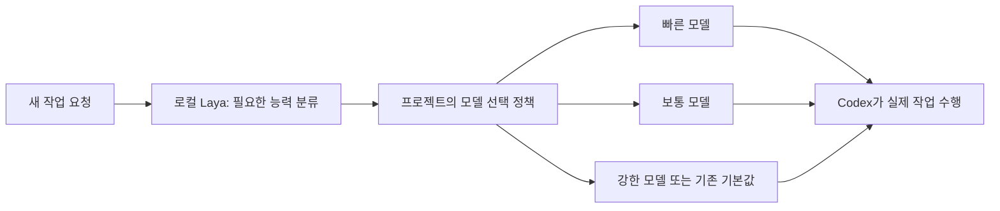

# laya-tools

[작은 주장·힌트 모델용 개발 자료](experiments/short-claim/next60-development-thirtythree/README.ko.md)를 **33개 요청·96라벨**로 늘렸습니다. 실제 Go Reader의 33회 호출·반환·값 일치와 기존 30행의 바이트 보존을 확인했습니다. 고정한 원본 관측 42건의 조건 318개를 재현하는 [오프라인 검사](scripts/verify-next60-thirtythree.sh)를 제공합니다. 새 모델 학습은 아직 0회이며, 약 60개 수집 뒤에도 원천 중복·역할 분리·후보 위치 편향을 검토해야 합니다. Codex 절감 효과는 아직 검증하지 않았습니다.

[HF30 고정 버전](https://huggingface.co/datasets/JooYoon/riidolaya-shortclaim-next60-development/tree/next60-30-finite-v1)을 게시해 소유558파일·표30행의 모든 값과 순서를 확인했습니다. [실제 게시·PR121 CI 근거](experiments/short-claim/publication-proof-122/README.ko.md)를 보세요. Linux·macOS의 새30행 재현 검사와 기존 Laya native 검사가 각각 통과했고 CI 봇이 병합했습니다. GPU 실행은 확인하지 않았습니다. [다음 원천22개 제안과 보류 이유](experiments/short-claim/next60-new-source-preview/README.ko.md)를 구분해 기록합니다.

[세 과제의 실행 전 기대값·후보 설명](experiments/short-claim/next60-native-three-preparation/README.ko.md)을 고정한 뒤 14입력·9후보·42실행을 실제로 관찰했습니다. 이 배치에서 긍정 3개·부정 5개를 채택했고, 원본 JSON Int의 오류 채널을 확인할 수 없는 후보 1개는 라벨 없이 제외했습니다. 알려진 반례와 확인 불가 조건이 함께 있어도 두 근거를 그대로 보존합니다. [기존 PR122 CI·Wiki 게시와 저장 공간 기록](experiments/short-claim/publication-proof-123/README.ko.md)을 유지합니다.

<details>
<summary>이전 단계 기록 — 아래 수치와 “현재”는 각 단계 작성 당시 상태입니다</summary>

[다음 개발 학습 안내](docs/wiki/Next60-Development-KO.md): [현재 유한 개발 자료](experiments/short-claim/next60-development-seven/README.ko.md)는 **요청 7개·라벨 20개**입니다. [네 작업의 실제 실행과 독립 검토](experiments/short-claim/next60-four-selector-actual-observation/README.ko.md)에서 입력 19개·관측 57개를 확인했습니다. 원본 검사 프로세스의 OS 최대 RSS는 약 7.89 MiB이며 모델 추론 메모리나 비용 절감 수치는 아닙니다. 기존 세 줄은 그대로 보존했습니다. [HF 7개 요청 고정 버전](https://huggingface.co/datasets/JooYoon/riidolaya-shortclaim-next60-development/tree/next60-7-finite-v1)의 112개 파일과 viewer 7행을 확인했습니다. [게시 기록](experiments/short-claim/publication-proof-116/HF-PUBLICATION.v3.json)을 보세요. 새 학습은 0회이며 [다음 의미 작업 10개의 구체화](experiments/short-claim/next60-catalog10-literal-correction/TRANSITION.ko.md)를 이어갑니다.

다음 학습 라운드의 [개발용 유한 요청 2개를 적격화](experiments/short-claim/next60-native2-qualification/README.ko.md)했습니다. 기존 초안 ID 두 개의 후보 5개에 긍정 2개·부정 3개를 부여했고, 문장 모두 기존 입력 제한을 통과했습니다. 기존 79개 자료는 그대로이며 새 학습은 아직 0회입니다. 적격 자료를 30개·60개로 늘린 뒤 별도 학습 비교를 진행합니다.

[첫 두 과제의 실제 원본 관측](experiments/short-claim/next60-native2-actual-observations/README.ko.md)을 완료했습니다. 요청2개·입력9개·후보5개를 한 번 실행해 관측23개를 얻었으며 패닉·확인 불가는0입니다. 적합 후보는 각각5/5·4/4입력을 만족했고 다른 후보의14개 관측은 불일치했습니다. 자식 OS 최대 RSS는약9.11MiB, 시작·검증을 포함한 시간은약0.37초입니다. 이는 모델 추론이나 절감 증명이 아닙니다. 관측 당시 새 학습 자격·추가 Fit은0이었으며 이전 보류 기록과 [v5 소스 수정](experiments/short-claim/next60-native2-outside-v5-preparation/README.ko.md)을 보존합니다.

다음 PDCA는 [계약 초안20개](experiments/short-claim/next60-acquisition-drafts/README.ko.md)를 실제 검사로 적격화하며 30개·60개로 넓힙니다. 새 라운드의 현재 적격은 7개이며, 같은79개 자료의 반복 튜닝은 멈췄습니다. [판단 근거와 도메인·2,400개 최종 평가 계획](experiments/short-claim/next-pdca-after-79/REPORT.ko.md)을 보세요. 실패79 모델은 [고정 HF 커밋](https://huggingface.co/JooYoon/riidolaya-shortclaim-data-effect-failed-79/tree/5bef215895b69d3f2ef4b82bb3f1970279d67f46)에 비활성 보관했고 21개 파일을 다시 내려받아 지문을 확인했습니다.

최근 [데이터 추가 학습79](experiments/short-claim/data-effect-fit-79/README.ko.md)는 검증된 요청3개를 추가해 같은 조건으로 실제 학습했습니다. 후보 확인은 기존 모델과 같은31회로, 단순 정렬27회를 넘겨 개선 기준을 실패했습니다. 전체 학습 작업자는 CPU1개·1.244초·OS 최고 메모리35.08MiB였으며 새 모델도 비활성으로 보관합니다.

이전 [작은 학습 모델 두 방식](experiments/short-claim/second-ranking-fit-72/README.ko.md)도 효용 검사를 실패했습니다. [Go 특징 계산](experiments/short-claim/feature-prefix-74/README.ko.md)은 두 공개 예제에서 시간을 약20~24% 줄였지만 할당량은 같았습니다.

[공개 함수 동작 검증](experiments/short-claim/native-observation-80/ACTUAL-RESULTS.ko.md)은 UUID Parse·Scan·Ordinal의24개 입력이 사전 기대값과 일치했습니다. 전체 프로그램 RSS17.27 MiB·wall1.21초이며 모델 추론이나24개 독립 요청은 아닙니다. [시점별 연구·실패 기록](RESEARCH-HISTORY.ko.md)과 [상세 문서](docs/README.md)에 측정 범위와 근거를 보존합니다.


</details>

**한국어** · [English](README.en.md) · [사용자 Wiki](https://github.com/teamswyg/laya-tools/wiki) · [문서 목록](docs/README.md)

[](https://github.com/teamswyg/laya-tools/actions/workflows/ci.yml)
[](https://github.com/teamswyg/laya-tools/releases/latest)
[](go.mod)
[](LICENSE)
[](docs/repository-routing-preview.ko.md)

**모델 선택을 프로젝트가 직접 관리하기 위한 로컬 AI 라우터 실험입니다.**

[처음 시작하기](https://github.com/teamswyg/laya-tools/wiki/Getting-Started-KO)에서 모델 다운로드 없이 첫 결과를 확인할 수 있습니다. 코드 검색·모델 선택 계획·저장소 preview 중 필요한 기능부터 선택하세요.

실행 명령어는 **`riidolaya`**입니다. 저장소와 Go 모듈 이름은 `laya-tools`를 유지하며, 기반 모델 Laya와 이 도구의 명령 이름을 구분합니다.

작은 판단 모델인 [Laya](https://huggingface.co/convaiinnovations/laya)를 로컬에서 실행하고, 작업에 필요한 모델의 수준을 판단합니다. 실제 코딩은 Codex가 맡습니다. 코드 검색에서는 큰 모델에 전달할 후보 코드의 순서를 Laya가 조정합니다.

검색·라우팅·토큰화·추론 호출·에이전트 인터페이스를 Go로 구현했습니다. 사용자가 도구를 실행할 때 Python이나 별도 모델 API 키는 필요하지 않습니다. **Codex 연동은 선택 사항**이며, 향후 riido-daemon에서 사용할 인터페이스도 Go 기반으로 발전시킵니다.

> 현재는 직접 사용하며 검증하는 초기 버전입니다. 로컬 실행과 CI는 구현했지만, 실제 Codex 비용이나 포함 사용량을 줄였다는 결과는 아직 없습니다.

## 왜 만들었나요?

이 프로젝트는 Codex 요금제와 포함 사용량의 변경에 관한 안내를 계기로 시작했습니다. 모델은 다양해지고, 같은 작업이라도 어떤 모델과 추론 설정을 선택하느냐에 따라 사용량·속도·완성도가 달라집니다. 그런데 작업을 시작하기 전에 필요한 능력과 소모량을 예상하는 일은 여전히 사람의 판단에 많이 의존합니다.

주석의 오타를 수정하는 일과 여러 서비스에 걸친 동시성 장애를 해결하는 일에 같은 수준의 모델이 필요한지, 프로젝트 관리 관점에서 직접 판단해 보고 싶었습니다. 개발·실험에 사용할 수 있는 에이전트 사용량을 활용해 도구를 만들고, 반복적인 작은 판단은 로컬 모델에 맡기는 것이 출발점입니다.

프로젝트의 가설은 다음과 같습니다.

> **AI 에이전트에 어떤 모델을 배정할지는 프로젝트의 품질·예산·일정을 함께 다루는 독립적인 관리 영역이다. 따라서 그 선택 정책을 프로젝트가 소유하는 라우터가 필요하다.**

서비스 제공자의 수익 유인과 사용자의 비용 절감 목표는 항상 일치하지 않을 수 있습니다. 공급자가 자동으로 가장 경제적인 모델을 배정해 줄 것이라고 전제하기보다는, 사용자가 작업별 선택 기준과 결과를 관찰하고 조절할 수 있어야 한다고 봅니다.

이는 특정 기업이 앞으로 최적화를 하지 않을 것이라거나 의도적으로 토큰을 낭비하게 만든다는 단정이 아닙니다. 공급자도 최적화를 발전시킬 수 있지만, 프로젝트별 성공 기준과 예산에 맞는 선택까지 보장되는지는 별도로 검증해야 한다는 문제의식입니다. 구체적인 요금과 포함 사용량은 바뀔 수 있으므로 특정 가격표에 의존해 설계하지 않습니다.

목표는 작은 모델을 최대한 많이 쓰는 것이 아니라 **작업을 성공적으로 끝내는 데 드는 전체 비용을 낮추는 것**입니다. 저렴한 모델이 실패해 재시도를 반복하면 오히려 손해일 수 있습니다. 따라서 사용량뿐 아니라 성공률, 걸린 시간, 재작업까지 함께 평가해야 합니다.

## Laya가 하는 일과 Codex가 하는 일

Laya는 코드를 생성하는 모델이 아닙니다. 입력을 읽고 주어진 선택지 중 하나를 고르는 작은 판단 모델입니다. Jevgrep 같은 도구의 접근법을 참고하되, 이 프로젝트의 실제 로컬 추론에는 공개 Laya 가중치를 사용합니다. Jev와 Laya가 같은 모델이라는 뜻은 아닙니다.



예를 들어 오타 수정은 빠른 모델 후보, 일반적인 기능 구현은 보통 모델 후보, 어려운 디버깅이나 설계는 강한 모델 후보입니다. 이는 분류 기준의 예시이며 현재 모델의 정확도를 보장하는 설명은 아닙니다.

Laya의 추천과 실제 적용 결과는 구분합니다. 확신도가 낮거나 입력이 잘렸거나 지원 범위 밖이라면 강한 모델을 유지합니다. 사용자가 모델을 직접 지정한 경우에는 그 선택이 우선합니다.

현재 라우터는 **새 Codex CLI 세션을 시작할 때 한 번** 선택합니다. 실행 중인 대화의 모델을 바꾸거나 API 요청을 가로채지는 않습니다.

## 샤라웃: Laya 생태계와 laya.tools

[Laya](https://huggingface.co/convaiinnovations/laya) 모델과 [오픈소스 SDK](https://github.com/NandhaKishorM/laya)를 공개한 개발자들, 그리고 활용 사례를 모아 소개하는 **[laya.tools](https://laya.tools/)**에 감사드립니다.

laya.tools는 Laya를 기반으로 만든 런타임, 라우팅, 에이전트 도구, 코드 검색과 데모를 찾아볼 수 있는 커뮤니티 디렉터리입니다. 이 프로젝트가 탐색하는 “작은 로컬 모델로 선택을 판단하고, 큰 모델은 필요한 작업에 배정한다”는 접근을 이해하는 데 유용한 사례들을 소개합니다.

- [프로젝트 디렉터리](https://laya.tools/): 런타임·라우팅·검색 등 용도와 실행 플랫폼별 프로젝트 탐색.
- [로컬 실행 가이드](https://laya.tools/guides/run-laya-locally): Laya를 직접 실행해 보기 위한 참고 자료.
- [쇼케이스](https://laya.tools/showcase): 작은 판단 모델을 실제 도구와 연결한 데모 모음.
- 디렉터리에 소개된 **laya-mlx**, **laya-coreml** 같은 Apple Silicon 런타임도 향후 구현 방식과 성능을 비교할 참고 대상입니다.

사이트는 스스로 독립적인 커뮤니티 디렉터리라고 밝히고 있습니다. 이 프로젝트는 laya.tools나 Laya 개발팀의 공식 제품 또는 제휴 프로젝트가 아닙니다. 소개된 다른 프로젝트의 속도·메모리·비용 절감 수치를 우리 도구의 성능으로 가져오지 않으며, 자체 측정 결과는 따로 기록합니다.

## 현재 가능한 기능

| 기능 | 하는 일 |
|---|---|
| `search` | 코드 후보를 키워드로 찾고, 선택적으로 Laya가 관련성 순서를 조정합니다. |
| `route` | 모델을 추천하고 적용 정책의 결과만 보여줍니다. Codex를 실행하지 않습니다. |
| `plan` | 설정한 모델·예산·전환 비용을 비교하고 실행 전 계획만 반환합니다. |
| `repo-preview` / `repo-serve` | 로컬 목록으로 저장소 선택을 preview합니다. 단일 요청 또는 warm JSONL을 지원합니다. |
| `codex` | 선택된 모델로 설치된 Codex CLI의 새 작업을 시작합니다. |
| `serve` | 모델을 메모리에 유지하고 JSONL 요청을 순서대로 처리합니다. |
| `mcp` | 에이전트에 코드 검색과 모델 추천 도구를 제공합니다. |
| `bench` | 로딩 시간·추론 시간과 Go 프로파일을 측정합니다. |
| `setup` / `doctor` | 모델 설치·무결성 확인과 로컬 환경 진단을 수행합니다. |

요금제의 남은 사용량 조회, 실시간 가격 비교, 사용량에 따른 자동 정책 변경, 실패 후 강한 모델로 재시도하는 기능은 **아직 구현하지 않았습니다**. 현재 자동 선택 기준은 요청의 난이도 분류와 명시적인 정책입니다.

## 설치와 첫 실행

Apple Silicon macOS를 우선 대상으로 만들었으며 Linux amd64도 CI에서 검사합니다. [릴리스](https://github.com/teamswyg/laya-tools/releases)의 운영체제에 맞는 실행 파일을 사용할 수 있습니다. 명령 이름을 반영한 `riidolaya-v…-darwin-arm64.tar.gz` 또는 `riidolaya-v…-linux-amd64.tar.gz`를 선택합니다. 다운로드한 압축파일은 함께 제공되는 `SHA256SUMS`와 비교한 뒤 풀어 주세요.

소스에서 빌드하려면 Go 1.27.1과 C 컴파일러가 필요합니다. macOS에서는 Command Line Tools가 C 컴파일러를 제공합니다.

```sh
git clone https://github.com/teamswyg/laya-tools.git
cd laya-tools
go build -trimpath -o bin/riidolaya ./cmd/riidolaya

./bin/riidolaya search --root . --lexical --json 'routing confidence'

# 선택 사항: 로컬 모델과 네이티브 런타임 설치
./bin/riidolaya setup
./bin/riidolaya doctor
./bin/riidolaya search --root . 'where is routing confidence checked?'
```

v0.1.0의 실행 명령은 `laya`였으며, 새 버전부터 `riidolaya`를 사용합니다. 기존 모델 캐시와 `LAYA_*` 환경변수는 그대로 재사용합니다.

아래 예시는 실행 파일이 PATH에 등록되어 `riidolaya`로 실행되는 경우입니다. 소스 빌드 직후에는 `riidolaya` 대신 `./bin/riidolaya`를 사용하면 됩니다. **옵션은 질문 앞에** 적습니다.

`setup`은 공개 모델과 ONNX Runtime을 내려받아 압축파일과 내부 파일의 SHA-256을 검증합니다. 최초 모델 다운로드는 약 446 MiB이고, 설치된 모델 파일은 약 572 MiB입니다. 이후 검색과 라우팅 추론은 로컬에서 수행됩니다.

캐시 위치는 macOS의 `~/Library/Caches/laya-tools`, Linux의 `~/.cache/laya-tools`입니다. `LAYA_CACHE`로 변경할 수 있습니다. Go 실행 파일 하나가 동작을 관리하지만, 모델과 네이티브 추론 라이브러리는 캐시에 별도로 존재합니다.

Laya의 공개 가중치를 로컬에서 사용하므로 Laya 판단마다 외부 API 사용료가 발생하지 않습니다. 다만 로컬 메모리·CPU·전력은 사용하며, 이후 실행하는 Codex의 사용량은 기존 요금제나 과금 정책을 따릅니다.

## 코드 검색 사용법

```sh
# 관련 코드의 경로, 줄 번호, 본문을 출력합니다.
riidolaya search --root /path/to/repository 'where are redirect headers removed?'

# Laya 없이 가벼운 키워드 검색만 실행합니다.
riidolaya search --root . --lexical --json 'redirect authorization'

# 코드 관련성 평가용 파생 모델을 설치하고 사용합니다.
riidolaya setup --checkpoint code
riidolaya search --checkpoint code --candidates 8 --limit 3 'redirect authentication'

# 한국어 질문의 후보 검색에 영어 식별자 힌트를 줍니다.
riidolaya search --candidate-query 'gzip decoder' 'gzip 압축을 해제하는 코드'
```

검색은 `키워드 후보 검색 → Laya 관련성 평가 → 중복 구간 제거 → 코드 일부 반환` 순서입니다. 기본값은 후보 8개를 평가하고 결과 최대 3개를 반환합니다. 벡터 데이터베이스는 만들지 않습니다.

Git 저장소 루트에서는 Git의 파일 목록과 무시 규칙을 사용합니다. 저장소 하위 폴더나 일반 디렉터리 검색에는 `rg`가 필요합니다. 파일 변경이 반영되도록 요청마다 목록과 내용을 다시 읽습니다. `serve`와 `mcp`는 추론 모델을 계속 유지하지만 코드 인덱스를 영구 저장하지 않습니다.

읽는 양과 메모리 사용을 제한하기 위해 숨김 파일, 일반적인 생성 폴더, 심볼릭 링크, 명백한 자격증명 파일명, 바이너리와 256 KiB보다 큰 파일을 제외합니다. 전체 소스 32 MiB, 코드 구간 50,000개, 후보 64개까지 허용합니다. 후보 하나의 모델 입력은 최대 512토큰이며 잘린 경우 결과에 표시합니다. 이 제외 규칙은 모든 비밀정보를 탐지하는 보안 스캐너를 대신하지 않습니다.

키워드 검색에서 후보가 없으면 Laya도 되살릴 수 없습니다. 영어 기반 체크포인트이므로 한국어 품질은 아직 검증되지 않았습니다. 모델이나 런타임이 없으면 경고와 함께 키워드 검색으로 대체합니다.

## 모델 라우터 사용법

실제 모델 이름은 사용자가 지정합니다. 모델 이름과 가격을 코드에 고정하지 않으므로 공급자의 모델 구성이 바뀌어도 정책을 바꿔 사용할 수 있습니다.

```sh
# 실제로 사용할 수 있는 모델 ID로 바꿔 입력합니다.
export LAYA_FAST_MODEL='your-fast-model-id'
export LAYA_STANDARD_MODEL='your-standard-model-id'
export LAYA_STRONG_MODEL='your-strong-model-id'

# 추천과 정책 적용 결과만 확인합니다.
riidolaya route --json 'Fix a spelling mistake in this comment'

# Codex를 실행하지 않고 전달될 인자를 확인합니다.
riidolaya codex --dry-run 'Investigate a concurrency bug'

# 추천 결과로 새 Codex CLI 세션을 시작합니다.
riidolaya codex 'Investigate a concurrency bug'

# 사용자가 지정한 모델이 라우터의 판단보다 우선합니다.
riidolaya codex --model 'your-explicit-model-id' 'Implement the feature'
```

`route`는 추천만 반환합니다. `codex`는 Laya 메모리를 해제한 뒤 기존에 설치된 Codex를 실행합니다. 로그인 정보나 API 키를 별도로 읽거나 저장하지 않고, Codex의 권한·승인 설정도 변경하지 않습니다. 실제 Codex 작업은 기존 공급자와 통신합니다.

강한 모델을 지정하지 않으면 원래 Codex의 기본 모델을 유지합니다. 다음 조건에서도 강한 모델 또는 기존 기본값을 사용합니다.

- 확신도가 기준값보다 낮음: 기본 `0.9`.
- 입력이 모델의 토큰 한도를 넘어 잘림.
- 모델 로딩이나 추론 실패.
- 선택된 등급의 모델 이름이 설정되지 않음.
- 아직 난이도 분류를 검증하지 않은 한국어 요청.

JSON의 `suggested_tier`는 Laya가 제안한 등급, `tier`와 `model`은 정책을 적용한 결과입니다. `confidence`는 **제안한 등급의 확률**이며, 작업 성공 가능성이나 최종 모델의 정확도를 뜻하지 않습니다. `abstained`가 참이면 더 약한 모델로 내리는 판단을 보류한 것입니다.

라우팅에는 기본 `base` 체크포인트를 권장합니다. `code`는 코드 관련성 평가용 파생 모델입니다. 현재 기본 확신도 설정이 매우 보수적이라는 점은 아래 측정 결과에서 확인할 수 있습니다.

## 생태계에서 가져온 Go 정책 모듈

[laya.tools](https://laya.tools/)에서 찾은 **system-one-router**와 **pi-pignon**을 참고해 재사용 가능한 정책을 추가했습니다. 출처·고정 커밋·라이선스·변경점은 [생태계 조사와 이식 문서](docs/ecosystem.ko.md)에 정리했습니다.

| 공개 패키지 | 하는 일 |
|---|---|
| `pkg/catalog` | 필요한 품질·도구·컨텍스트·예산 조건을 만족하는 후보 중 추정 비용 비교 |
| `pkg/switchpolicy` | 잦은 모델 변경을 막고, 변경으로 잃는 캐시 비용을 회수할 수 있는지 판단 |
| `pkg/planner` | 두 정책을 합쳐 추천·유지·보류 결과와 근거 반환 |

쉽게 말하면 **Laya는 작업 난이도를 판단하고, Go 정책은 그 판단을 그대로 실행해도 되는지 검사합니다.** 예산이나 품질 조건을 통과하지 못하면 저렴한 모델이 있어도 추천하지 않습니다.

```sh
# 저장소 루트에서, 모델 로딩 없이 가상 예제로 정책 확인
riidolaya plan --config examples/planner/config.json --request examples/planner/request.json --json

# 마지막에 작업 문장을 주면 로컬 Laya 분류도 사용
riidolaya plan --config examples/planner/config.json --request examples/planner/request.json --json 'Fix a spelling mistake in a comment'
```

예제의 가격·품질·확신도는 설명용 가상 값입니다. `plan`은 비용을 추정할 뿐 유료 모델 호출이나 실제 모델 변경을 하지 않습니다. 현재 Codex 대화에도 자동 적용되지 않습니다. 가격 기반 추정은 Codex 구독 사용량 계산이 아니며, 실제 비용 절감은 아직 미검증입니다. 에이전트는 JSON의 `plan.status`가 `recommend`, `hold`, `blocked` 중 무엇인지 확인하면 됩니다.

## GitHub 저장소 선택 preview

뤼이도가 알고 있는 저장소 이름·역할 요약·키워드를 로컬 JSON으로 받아 작업에 맞는 후보를 보여줍니다. 공개 패키지는 `pkg/reporouter`입니다. 실제 저장소 조회·clone·작업 실행이나 뤼이도 연결은 하지 않습니다.

```sh
riidolaya repo-preview --catalog examples/repositories/catalog.json --json 'refund invoices'
riidolaya repo-preview --catalog examples/repositories/catalog.json --laya --json 'refund invoices'
riidolaya repo-serve --catalog examples/repositories/catalog.json --laya
```

기본은 모델 없는 키워드 검색이며 `--laya`는 영어용 로컬 모델을 추가하는 실험 옵션입니다. **첫 가상 예제 평가에서는 Laya의 이득을 확인하지 못했습니다:** 원시 선택 8/15 정답, 기본 기준을 통과한 추천 0건. 키워드만 사용한 프로세스는 약 11.5MiB, Laya를 로딩한 프로세스는 약 1.40GiB 최대 RSS였습니다. 쉬운 개발 예제 결과로 운영 정확도를 주장하지 않습니다.

[라우팅 적합성·preview 사용법·측정 결과](docs/repository-routing-preview.ko.md)에 한계와 뤼이도 연결 순서를 정리했습니다. 모든 결과는 preview이며 `candidate`를 실행 허가로 해석하지 않습니다.

## 오픈소스 라이선스와 배포 고지

현재 구성 요소는 확인된 Apache-2.0/MIT/BSD-3-Clause 조건을 따라 수정·재배포할 수 있도록 고지를 보존합니다. 기존 모델 묶음에서 누락한 laya-code NOTICE와 CLI 의존성 고지를 보완했고, `models-v2`에 변환 내역·출처를 포함했습니다. 새 버전의 `riidolaya setup`으로 고지가 포함된 모델 묶음을 받습니다.

[라이선스 검토 문서](docs/license-audit.ko.md)는 원문, 의무, 실제 수정, 남은 한계를 구분합니다. CI는 의존성 변경과 고지 누락을 검사하지만, 모델 학습 데이터의 권리까지 보증하지는 않습니다.

## 사람과 에이전트가 함께 쓰는 인터페이스

사람에게는 일반 텍스트, 에이전트에는 `--json`을 제공합니다. 오류는 stderr와 0이 아닌 종료 코드로 알립니다. `search`·`route`·`codex`는 질문 대신 `-`를 전달하면 stdin에서 읽습니다. `plan --request -`는 JSON 요청을 읽습니다. `repo-preview`는 질문 인자, `repo-serve`는 JSONL을 받습니다.

여러 요청을 처리할 때는 모델을 한 번만 로드하는 JSONL 모드를 사용할 수 있습니다.

```sh
riidolaya serve --root /path/to/repository
```

입력은 한 줄에 JSON 객체 하나이며, 응답도 한 줄에 하나입니다.

```json
{"id":1,"op":"search","query":"redirect authentication"}
{"id":2,"op":"route","query":"Fix a typo"}
```

MCP 서버는 다음과 같이 실행합니다.

```sh
riidolaya mcp --root /path/to/repository
```

`search_code`와 `route_model` 두 도구를 제공합니다. Codex에서 쓰고 싶을 때만 명시적으로 등록합니다.

```sh
codex mcp add riidolaya -- /absolute/path/to/riidolaya mcp --root /absolute/path/to/repository
```

MCP의 라우팅 도구도 새 작업에 쓸 모델을 추천할 뿐, 현재 대화의 모델을 변경하지는 않습니다. macOS 자동 실행 서비스나 네트워크 포트도 자동으로 만들지 않습니다.

## riido-daemon과의 연동 방향

목표는 모델 선택을 riido-daemon의 작업 실행 정책으로 가져오는 것입니다. 지금은 Go에서 실행 파일을 호출하고 JSON/JSONL 응답을 읽는 방식으로 연동할 수 있습니다. 이미 riido-daemon에 연결되었다는 뜻은 아닙니다.

향후에는 다음 정보를 함께 다루는 방향을 검토합니다.

- 작업 종류와 실패했을 때의 영향.
- 프로젝트별 예산과 원하는 응답 시간.
- 모델별 실제 성공률, 사용량, 소요 시간.
- 판단 보류와 강한 모델 재시도 기준.

이제 `pkg/catalog`, `pkg/switchpolicy`, `pkg/planner`, `pkg/reporouter`를 외부 Go 프로그램에서 직접 import할 수 있습니다. 정책 패키지는 CGO나 모델 파일 없이 실행됩니다. 모델 추론과 기존 검색 엔진은 계속 `internal/`에 있으며, riido-daemon의 상태 저장·실제 실행 연결은 아직 구현하지 않았습니다.

사용자 실행 경로는 Go입니다. 원본 Laya 모델을 ONNX로 변환하고 기준 결과를 비교하는 **모델 유지보수용 Python 스크립트는 별도로 남아 있습니다**. 설치된 도구를 실행하거나 riido-daemon에서 호출할 때 Python을 띄우는 구조는 아닙니다.

## 지금까지의 측정 결과

Apple M4 Pro / 24 GiB / macOS에서의 초기 측정입니다. 자세한 조건과 원본 결과는 [측정 문서](docs/measurements.md)와 [결과 파일](benchmarks/results)에 있습니다.

| 항목 | 관찰 결과 |
|---|---|
| 짧은 판단 요청, 모델이 이미 로드된 상태 | CPU 설정별 중앙값 약 24~40ms |
| 기본 CPU 4스레드의 짧은 판단 | 중앙값 약 26ms |
| 모델 포함 전체 프로세스 메모리 | INT8 시험의 최대 RSS 약 1.4GiB |
| 코드 검색 재정렬 | 개발 질문에서 대략 1.6~1.8초 추가 소요, 일부 정확도 개선 |
| 기본 라우터 정책 | 시험 요청 12개 모두 강한 모델 유지 |
| Core ML / GPU | 현재 동적 변환 모델의 초기화 오류로 미검증 |

따라서 지금 버전의 결론은 “Laya를 추가하면 무조건 더 싸고 빠르다”가 아닙니다. **현재 라우터 시험에서는 모델 하향 선택이 0건이었고, 비용 절감도 증명하지 못했습니다.** 코드 검색 역시 키워드만으로 잘 찾는 경우에는 Laya를 추가하는 것이 더 느립니다.

이 프로젝트는 이런 결과를 감추지 않고 선택 기준을 검증하기 위한 실험 환경입니다. 추후 동일한 코딩 과제에서 성공률·총 사용량·걸린 시간·재시도를 함께 비교해야 합니다. 기본값을 낮춰 숫자만 좋아 보이게 만드는 것은 목표가 아닙니다.

## CPU·메모리·GPU 측정

```sh
riidolaya bench --iterations 30 --threads 4
riidolaya bench --cpu-profile cpu.pprof --heap-profile heap.pprof --ort-profile ort-trace

go tool pprof -top cpu.pprof
go tool pprof -top heap.pprof

# macOS: 전체 프로세스의 최대 메모리도 따로 봅니다.
/usr/bin/time -l riidolaya bench --iterations 30
```

Go pprof는 Go 메모리와 CPU 샘플을 보여줍니다. 네이티브 모델 추론은 `runtime.cgocall`이나 이름 없는 프레임으로 보일 수 있으며, **전체 네이티브 메모리나 GPU 메모리를 나타내지 않습니다**. 실제 실행 공급자는 ONNX Runtime 추적으로, GPU 세부 수치는 macOS Instruments 같은 도구로 따로 확인해야 합니다.

`--provider coreml`은 실험 옵션입니다. 현재 시험에서는 모델 초기화에 실패했으므로 CPU INT8을 기본값으로 사용합니다. 파일 프로파일에는 로컬 경로 등이 포함될 수 있어 공개 저장소에 올리지 않습니다.

## 사람 승인 대신 CI를 개발의 검토 기준으로

개발 루프는 `변경 → 테스트 → PR → CI 검증 → 자동 병합 → 릴리스 검사`입니다. 메인 브랜치에는 `quality` 검사 통과가 필요하고, 사람 리뷰 승인은 요구하지 않습니다.

[CI](.github/workflows/ci.yml)는 다음을 확인합니다.

- Go 포맷, 경쟁 상태 검사 포함 테스트, 정적 검사.
- macOS와 Linux에서 실제 모델 다운로드 및 네이티브 추론.
- Python 원본 기준과 Go 토큰화 결과의 일치.
- 공개 이력에 대한 비밀정보 검사.
- 실제 의존성 버전과 라이선스 고지 목록 검사.

쓰기 권한이 있는 작성자의 동일 저장소 PR은 검사가 통과하면 자동 squash 병합합니다. Draft PR은 자동 병합 대상이 아닙니다. 외부 fork PR은 권한이 제한된 환경에서 검사하며 자동 병합 대상으로 취급하지 않습니다. 병합 권한이 있는 워크플로는 PR 코드를 체크아웃하거나 실행하지 않습니다.

버전 태그는 테스트와 실제 추론을 다시 통과해야 바이너리와 체크섬을 배포합니다. 별도의 사람 승인 환경은 두지 않습니다. CI는 객관적인 검사 기준이며 모든 의미적 오류를 잡는다는 보장은 아닙니다. 이 정책은 **프로젝트 개발 변경의 승인 방식**이며, 사용자의 Codex 실행 권한을 자동으로 풀어주는 설정은 아닙니다.

## 개발과 재현

```sh
go test -race ./...
go vet ./...
go test -bench . -benchmem ./internal/search
```

네이티브 통합 검사는 `LAYA_MODEL_DIR`과 `LAYA_RUNTIME`을 지정해야 합니다. CI에서는 `setup` 이후 자동으로 지정합니다. 모델 변환은 [모델 빌드 문서](docs/model-build.md), 라우터 개요는 [설계 설명](docs/design.ko.md)을 참고하세요.

비공개 저장소의 코드, 실제 사용자 작업 프롬프트, 인증 정보와 원본 프로파일은 공개하지 않습니다. 공개 또는 직접 작성한 테스트 자료만 사용합니다. 모델과 런타임의 버전·라이선스·체크섬도 기록합니다.

라이선스: Apache-2.0. 외부 구성 요소와 모델 출처는 [NOTICE](NOTICE)에 정리되어 있습니다.

## 모델을 올리거나 내리는 양방향 추천

쉬운 작업은 낮추고, 어려운 작업은 현재 모델보다 강한 모델로 올릴 수 있습니다. 현재 모델은 요청 JSON의 `current`, 성능 순서는 설정의 `rank`로 지정합니다. 가격이 비싸다는 이유만으로 상향으로 판단하지 않습니다.

```sh
riidolaya plan --config examples/planner/config.json --request examples/planner/upgrade.json --json
```

이 예제는 `example-fast`에서 `example-strong`으로 `direction: upgrade`, `reason: quality_upgrade`를 반환합니다. 기존 `request.json`은 하향 예제입니다. 위 예제는 직접 제공한 난이도 평가를 사용하며 Laya 추론은 실행하지 않습니다. 명령 끝에 영어 작업 설명을 붙이면 로컬 Laya가 난이도를 평가합니다.

`direction`은 `upgrade`(상향), `downgrade`(하향), `lateral`(같은 등급), `initial`(첫 선택), `unchanged`(유지)이며, `blocked`에는 없습니다. 상향은 비용 회수 기간이나 전환 대기 횟수보다 품질을 우선하지만 예산·기능·컨텍스트 제약과 수동 고정은 무시하지 않습니다. Laya의 불확실한 판단은 상향 근거로 바꾸지 않으며, 현재 모델도 요구 조건을 못 맞추면 `blocked`입니다. 기본 설정에서는 catalog의 확신도 기준 0.9도 통과해야 하므로 switch의 상향 기준 0.5만 넘는다고 추천하지 않습니다.

추천만 반환합니다. 진행 중인 Codex 대화를 자동 전환하거나 실패를 감지해 재실행하지 않습니다. 연동하는 에이전트가 작업 단계마다 현재 모델과 평가를 갱신해 호출해야 합니다.

[GitHub Actions 기능별 성능 검사](docs/performance-replay.ko.md): 고정 시나리오의 CPU 시간·최대 RSS·실행 결과를 수동 실행으로 비교합니다.

[배열·lock·SIMD 검토와 난이도 골든셋 결과](docs/layout-and-goldens.ko.md)

## 로컬 학습과 평가

[PDCA 튜닝 설명](docs/pdca-tuning.ko.md)에서 고정된 평가 기준, 실제 MPS 학습,
실패 기록과 다음 데이터 준비를 볼 수 있습니다. 진행 체크는 [이슈 #11](https://github.com/teamswyg/laya-tools/issues/11)에 기록합니다.
현재 학습은 영어 합성 난이도 사례에 대한 유지보수 실험이며, 기본 Go 모델 교체나 실제 코딩 비용 절감의 증거는 아닙니다.

### Go 초소형 헤드·3진 실험

[별도 경량화 연구](experiments/tinyhead/README.ko.md)에서 v0.2 헤드를 Go로 실행하고 FP32·INT8·3진을 비교합니다.
264건의 기존 합성 데이터에서 판단 변경 없이 20,772B 헤드를 660B로 줄였지만, 전체 Laya 인코더는 여전히 필요하며 3진이 더 빠르지는 않았습니다.
[공개 HF 컬렉션](https://huggingface.co/collections/JooYoon/riidolaya-public-research-6abcbd5ddb1917912fc5de38) · [실험 #15](https://github.com/teamswyg/laya-tools/issues/15).

[3진 QAT 학습·PDCA 결과](experiments/ternary-qat/README.ko.md): Go로 32개 후보를 실제 학습하고 572B 헤드를 만들었습니다.
새 합성 final에서 부모 33/36 → 두 seed 모두 34/36이며, 파일 전체는 선형 계수당 1.490bit입니다.
인코더는 그대로이고, 확률 품질은 일부 나빠져 실험 모델로만 제공합니다. [진행 이슈 #17](https://github.com/teamswyg/laya-tools/issues/17).
