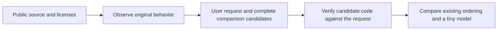

# Preparing training data for tiny behavior hints

The goal is for a small Go model to **suggest which candidate to check first**. Every candidate and independent verification remain available. A high model score does not establish code correctness. Both existing learned models increased candidate checks and remain inactive by default.

## Function fixtures and training requests

Suppose eight inputs check how a UUID parser returns partial bytes and errors for malformed text. These are multiple examples of one behavior, not eight user requests or eight independent sources.

A user request could ask: preserve partial parser bytes on error, return the error, and do not convert it to a panic. Comparison candidates could clear the bytes on error, forward the original result, or turn errors into panics. An incorrect candidate's caption must still accurately describe that candidate's code.

The model receives the request and short candidate captions. Source, fixture inputs, Want/Got, truth, roles and training weights remain verification side data. Model scores do not generate truth.

## Four separate checks

| Check | Meaning |
|---|---|
| Code satisfaction | Does the candidate actually satisfy the request on the selected finite inputs? |
| Caption fidelity | Does the short caption accurately describe the source and candidate postprocessing? |
| Supervision eligibility | Are observation scope and caption connected well enough to support positive or negative training supervision? |
| Observation channels | Were the required values, errors, state and panic channels observed? |

Unsupported captions do not become negative code truth. Conversely, code that fails a request can provide a useful comparison candidate when its caption is faithful and the required execution evidence exists. Existing truth and loss masks therefore remain separate.

## Progress and the next fit

[Source80's actual results](https://github.com/teamswyg/laya-tools/blob/main/experiments/short-claim/native-observation-80/ACTUAL-RESULTS.en.md) matched expectations on 24 Parse, Scan and Ordinal inputs. A small conversion pilot prepares one request with three candidates for each of the three goals. It tests the conversion path; it does not prove learning utility or independent generalization.

[Source82 preparation](https://github.com/teamswyg/laya-tools/blob/main/experiments/short-claim/source-closure-82/ACTUAL-STATE.en.md) retains 57 source, module and license files needed for subsequent time, slice and flag-state checks. Acquisition is separate from compilation, original execution and training readiness. Full licenses and notices on copied Go code remain intact.

The [training-resume review](https://github.com/teamswyg/laya-tools/blob/main/experiments/short-claim/training-resume-review/REVIEW.v1.en.md) recommends completing these data connections first. After candidate evidence and supervision eligibility are bound, the four fixed controls and oracle are compared on the same complete candidate sets. If the existing headroom condition holds, one small FP32 development fit can test the data change. Requests are not selected for favorable scores and existing thresholds are not lowered.

Requests sharing source, helpers or copied-code lineage stay in the same group. Existing calibration/final data do not move into train. Already exposed validation remains a development regression check. The protected final minimum of 2,400 requests is still unmet and is not merged into the small conversion pilot's denominator.

This stage does not establish new model improvements, memory savings or reduced Codex costs. Model file size, Go allocations, total process RSS and GPU use require separate measurements. [한국어](https://github.com/teamswyg/laya-tools/wiki/Claim-Data-Preparation-KO)
