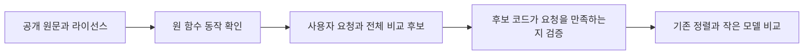

# 작은 동작 힌트의 학습 자료 만들기

목표는 작은 Go 모델이 **어느 후보부터 확인할지 힌트를 주는 것**입니다. 모든 후보와 독립 검증을 남깁니다. 모델의 높은 점수만으로 코드가 정답이라고 처리하지 않습니다. 기존 학습 모델 두 개는 후보 확인 수를 늘려 현재 기본값으로 사용하지 않습니다.

## 함수 예제와 학습 요청의 차이

UUID가 잘못된 문자를 받았을 때 부분 바이트와 오류를 어떻게 반환하는지 확인하는 입력 8개가 있다고 합시다. 이들은 같은 동작을 살피는 여러 예제입니다. 사용자 요청 8개나 독립 원천 8개로 세지 않습니다.

그 근거를 사용자 요청으로 바꾸면 “파서가 오류를 반환해도 부분 바이트를 보존하고, 오류를 숨기거나 panic으로 바꾸지 말라”가 됩니다. 비교 후보는 오류 때 값을 지우는 코드, 원문 결과를 그대로 반환하는 코드, 오류를 panic으로 바꾸는 코드입니다. 잘못된 후보의 설명도 그 후보 코드의 실제 동작을 충실히 설명해야 합니다.

이제 모델이 보게 되는 것은 요청과 짧은 후보 설명입니다. 소스·함수 입력·Want/Got·정답·역할·학습 가중치는 검증용 옆자료입니다. 모델 점수를 정답 작성에 사용하지 않습니다.

## 네 가지를 따로 확인합니다

| 확인 항목 | 쉽게 말하면 |
|---|---|
| 코드의 요청 충족 | 선택한 유한 입력에서 해당 후보 코드가 실제 요청을 만족하는가? |
| 설명의 충실도 | 짧은 설명이 원문과 후보의 후처리까지 정확히 설명하는가? |
| 감독 적격성 | 관찰한 범위와 설명이 연결되어 학습의 양성·음성으로 쓸 수 있는가? |
| 관찰 채널 | 값·오류·상태·panic 중 요청에 필요한 내용을 빠짐없이 확인했는가? |

설명에 근거가 부족한 경우를 코드가 틀렸다는 음성 정답으로 바꾸지 않습니다. 반대로 요청을 만족하지 않는 코드라도 설명이 그 코드를 정확히 설명하고 필요한 실행 근거가 있으면 유용한 비교 후보가 될 수 있습니다. 기존 truth와 학습 mask를 별개로 보존하는 이유입니다.

## 현재 진행과 다음 학습

[Source80 실제 결과](https://github.com/teamswyg/laya-tools/blob/main/experiments/short-claim/native-observation-80/ACTUAL-RESULTS.ko.md)는 Parse·Scan·Ordinal의 24개 입력에서 기대값이 일치했습니다. 세 목표를 요청 하나씩과 후보 세 개씩으로 연결하는 작은 pilot을 준비합니다. 이는 변환 경로를 확인하는 규모이며 학습 효용이나 독립 일반화의 증명이 아닙니다.

[Source82 준비 기록](https://github.com/teamswyg/laya-tools/blob/main/experiments/short-claim/source-closure-82/ACTUAL-STATE.ko.md)은 다음 시간·슬라이스·플래그 상태 검증에 필요한 원문 57파일을 보존합니다. 원문 취득은 컴파일·원 함수 실행·학습 준비 완료와 다릅니다. 라이선스 전문과 복사된 Go 코드의 고지를 함께 유지합니다.

[학습 재개 검토](https://github.com/teamswyg/laya-tools/blob/main/experiments/short-claim/training-resume-review/REVIEW.v1.ko.md)의 결론은 자료 연결을 먼저 완료하는 것입니다. 실제 후보 근거와 감독 적격성을 확인한 뒤 고정 네 기준선과 oracle을 같은 전체 후보 집합에서 비교합니다. 원래 개선 여지 조건을 충족하면 자료 변화의 효과를 보는 한 번의 작은 FP32 개발 학습을 별도로 계획합니다. 점수가 좋은 요청만 고르거나 기존 임계값을 낮추지 않습니다.

같은 원문·helper·복사 계보의 요청은 같은 그룹으로 묶습니다. 기존 calibration/final을 train으로 옮기지 않고 이미 살펴본 validation은 개발 회귀 검사로 표시합니다. 보호된 최종 최소 2,400개 요청은 아직 충족하지 못했으며 작은 변환 pilot의 분모에 합쳐 세지 않습니다.

현재 단계에서 새로운 모델 개선·메모리 절감·Codex 요금 절감을 주장하지 않습니다. 모델 파일 크기, Go 할당량, 전체 프로세스 RSS, GPU 사용량도 각각 따로 측정해야 합니다. [English](https://github.com/teamswyg/laya-tools/wiki/Claim-Data-Preparation-EN)
