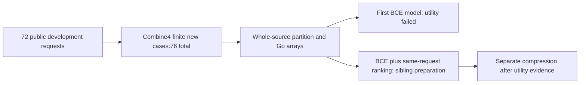

# Progress of the first tiny claim model


One fit completed, but the current model did not outperform existing controls. The target is a very small suggestion: “consider verifying this candidate first.” Preserve every candidate; a person or agent checks the actual evidence. Do not use this hint to authorize work or discard candidates.

On15 known validation requests, ordered lexical control required27 checks and the model31, a14.8% deterioration. Correct first candidates fell5→2 among10 answerable requests. Preserve the original5% improvement condition and the failure. Five unknown requests stay separate; five no-answer requests retain the cost of checking all candidates.

All76 development requests were assigned44train/20validation/12calibration by whole-source group. Prepared91/45 fit rows retain18/1 zero-weight rows. The model uses8192 FP32 coefficients in Go without a Laya encoder or GPU. Its32,792B file differs from26.98MiB whole-fit peak RSS. A0.805s single full-fit observation is not resident inference latency or Codex-token savings.



Average loss improved, while verification order worsened on three acquire/release/result-delivery requests. Do not attribute everything to the loss alone. One next experiment retains BCE and adds a relative-order term to raise acceptable candidates above negatives for the same request. Fix coefficient1, original seed/masks, validation-BCE epoch choice and utility gates in advance without searching. This is an objective sibling, not a compressed child.

The existing tool can run as a resident process now.

```sh
riido-shortclaim --stream --baseline lexical_ordered < requests.jsonl
```

Input contains a short request and1..8 candidates, preserving512-byte/32-normalized-word limits. Output includes every candidate in verification order and `unverified_heuristic` status. JSONL supports repeated person/agent use. This command does not load the first fitted coefficients or alter default Codex settings.

The original72 preparation dataset is public at an [exact HF commit](https://huggingface.co/datasets/JooYoon/riidolaya-public-claim-preparation-69/tree/d80075c6160a53d5426019cf018016a3b02017bd);20 files were downloaded again and compared. It contains no fitted coefficients. Read [full first-fit records](https://github.com/teamswyg/laya-tools/blob/main/experiments/short-claim/first-primary-fit-71/README.en.md), [actual array preparation](https://github.com/teamswyg/laya-tools/blob/main/experiments/short-claim/projection-execution-76/README.en.md) and [CI/Wiki/HF verification](https://github.com/teamswyg/laya-tools/blob/main/experiments/short-claim/publication-proof-93/README.en.md) as separate stages.

A follow-up chosen after seeing validation failure remains developmental even if it improves. These76 requests form19 related source groups and cannot replace the protected final target of at least2,400 distinct requests per domain. AI-assisted research cost and actual LLM savings remain unmeasured; source-diversity and production approval are false.

[한국어](First-Claim-Fit-71-KO)
