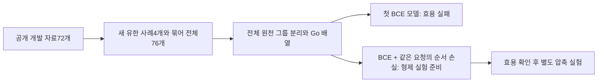

# 첫 작은 주장 모델은 어디까지 왔나


학습은 한 번 완료했지만 현재 모델은 기존 규칙보다 도움이 되지 않았습니다. 목표는 “이 후보부터 확인해 보면 좋겠다”라는 아주 작은 순서 힌트입니다. 모든 후보를 보존하고 사람·에이전트가 실제 근거를 확인합니다. 작업 승인이나 후보 삭제에 사용하지 않습니다.

정답을 아는 검증 요청15개에서 단어·순서 규칙은27번, 학습 모델은31번 확인했습니다. 약14.8% 악화했고 정답이 있는10개 요청 중 첫 후보가 정답인 경우도5→2였습니다. 기존5% 개선 조건은 그대로 두고 실패를 기록했습니다. 미확정5개는 별도 보존하고 정답 없음5개는 전체 후보 확인 비용을 유지합니다.

전체 개발 자료76개 중 train44/validation20/calibration12를 원천 그룹 단위로 분리했습니다. 학습에는91/45행을 사용하며0가중치18/1행도 물리적으로 보존했습니다. 모델은 Go의8192개 FP32 계수를 가지며 Laya 인코더·GPU 없이 실행했습니다. 파일32,792B와 전체 학습 최대RSS약26.98MiB는 다른 수치입니다. 약0.805초는 전체 학습 과정의 한 번 관측이고 상시 추론 지연·Codex 토큰 절감이 아닙니다.



첫 모델의 평균 손실은 줄었지만 획득·해제·결과 전달 순서의 검증 요청 세 개에서 순서가 악화했습니다. 손실 하나의 문제로 단정하지 않습니다. 다음 한 번은 기존 BCE를 유지하면서 같은 요청의 정답 점수가 오답보다 높아지도록 하는 상대 순서 손실을 추가합니다. 계수1·원래seed·마스크·validation BCE epoch 선택·검증 기준을 미리 고정하고 탐색하지 않습니다. 이 모델은 압축 자식이 아니라 목적을 바꾼 형제 실험입니다.

지금은 기존 도구를 상주 프로세스로 사용할 수 있습니다.

```sh
riido-shortclaim --stream --baseline lexical_ordered < requests.jsonl
```

입력은 짧은 요청과 후보1..8개이며512바이트/정규화32단어 한도를 유지합니다. 출력은 모든 후보의 확인 순서와 `unverified_heuristic` 상태입니다. JSONL 스트림으로 사람·에이전트가 반복 호출할 수 있습니다. 이 명령은 첫 학습 가중치를 읽지 않으며 기본 Codex 설정을 바꾸지 않습니다.

원래72개 준비 데이터는 [HF exact commit](https://huggingface.co/datasets/JooYoon/riidolaya-public-claim-preparation-69/tree/d80075c6160a53d5426019cf018016a3b02017bd)에 공개했고20개 파일을 다시 내려받아 대조했습니다. 모델 계수는 없습니다. [첫 학습의 전체 기록](https://github.com/teamswyg/laya-tools/blob/main/experiments/short-claim/first-primary-fit-71/README.ko.md), [실제 배열 준비](https://github.com/teamswyg/laya-tools/blob/main/experiments/short-claim/projection-execution-76/README.ko.md), [CI·Wiki·HF 확인](https://github.com/teamswyg/laya-tools/blob/main/experiments/short-claim/publication-proof-93/README.ko.md)을 구분해 읽을 수 있습니다.

같은 validation을 보며 후속을 선택했으므로 개선돼도 개발 신호입니다. 76개는 관계가 묶인19그룹의 개발 자료이고 도메인별 최소2,400개 독립 요청의 보호된 최종 골든셋을 대신하지 않습니다. 협업 AI 비용과 실제 LLM 절감은 아직 미측정이며 source 다양성·production 승인은 하지 않았습니다.

[English](First-Claim-Fit-71-EN)
